```mermaid
flowchart TD
    Start([Start Process])
    Decision{Condition?}
    Action1[Action if True]
    Action2[Action if False]
    End([End Process])

    Start --> Decision
    Decision -->|Yes| Action1
    Decision -->|No| Action2
    Action1 --> End
    Action2 --> End
```

# Diagram Standards

**Purpose**: Standards for creating diagrams, visualizations, and technical illustrations for the textbook

**Last Updated**: 2025-12-05

---

## General Guidelines

### Quality Requirements

- **Resolution**: Minimum 1200px width for raster images
- **File Size**: Maximum 500KB per image (optimize for web)
- **Format**: PNG for screenshots/photos, SVG for diagrams (preferred)
- **Accessibility**: Include alt text describing diagram content
- **Clarity**: Text readable at 100% zoom, labels clear

### File Organization

```
static/
├── img/                    # General images (logos, photos)
├── diagrams/
│   ├── module-01/         # Module 1 diagrams
│   ├── module-02/         # Module 2 diagrams
│   ├── module-03/         # Module 3 diagrams
│   ├── module-04/         # Module 4 diagrams
│   └── capstone-project/  # Capstone diagrams
```

### Naming Convention

```
module-XX-concept-name-type.ext

Examples:
- module-01-ros2-architecture-system.svg
- module-02-gazebo-sensor-flow-flowchart.png
- module-03-perception-pipeline-architecture.svg
- module-04-behavior-tree-example-diagram.png
```

---

## Diagram Types

### 1. Architecture Diagrams

**Purpose**: Show system components and their relationships

**Tools**:
- **Mermaid** (text-based, version controlled)
- **Draw.io** (free, web-based)
- **Lucidchart** (paid, professional)

**Style**:
- Boxes for components
- Arrows for data flow or dependencies
- Colors to group related components
- Labels on all connections

**Example (Mermaid)**:


**When to Use**:
- System overview
- Component relationships
- Data flow between modules

---

### 2. Flowcharts

**Purpose**: Show process steps and decision logic

**Tools**:
- **Mermaid** (preferred for version control)
- **Draw.io**
- **Visio**

**Style**:
- Ovals for start/end
- Rectangles for processes
- Diamonds for decisions
- Arrows show flow direction

**Example (Mermaid)**:


**When to Use**:
- Algorithm logic
- Decision processes
- Control flow

---

### 3. Sequence Diagrams

**Purpose**: Show interactions over time between components

**Tools**:
- **Mermaid** (preferred)
- **PlantUML**
- **WebSequenceDiagrams**

**Style**:
- Actors/components at top
- Messages as arrows (left to right = request, right to left = response)
- Activation boxes show processing time
- Notes for explanations

**Example (Mermaid)**:


**When to Use**:
- ROS 2 topic/service interactions
- Multi-node communication
- Protocol sequences

---

### 4. State Machines

**Purpose**: Show system states and transitions

**Tools**:
- **Mermaid** (preferred)
- **PlantUML**
- **Draw.io**

**Style**:
- Circles for states
- Arrows for transitions
- Labels show trigger conditions
- Start/end markers

**Example (Mermaid)**:


**When to Use**:
- Robot behavior modes
- System states
- Control logic

---

### 5. Class/Entity Diagrams

**Purpose**: Show data structures and relationships

**Tools**:
- **Mermaid** (preferred)
- **PlantUML**
- **UML tools**

**Style**:
- Boxes for classes/entities
- Lines for relationships
- Arrows for inheritance/composition
- Cardinality noted (1-to-many, etc.)

**Example (Mermaid)**:


**When to Use**:
- Data models
- Code structure
- Entity relationships

---

### 6. Timing Diagrams

**Purpose**: Show temporal relationships and performance

**Tools**:
- **WaveDrom** (for digital signals)
- **PlotlyJS** (for performance graphs)
- **Matplotlib** (Python, for charts)

**Style**:
- Time on X-axis
- Signals/events on Y-axis
- Annotations for key events
- Grid for readability

**When to Use**:
- Real-time constraints
- Performance analysis
- Synchronization requirements

---

### 7. Network/Topology Diagrams

**Purpose**: Show ROS 2 nodes, topics, and services

**Tools**:
- **rqt_graph** (auto-generated from ROS 2)
- **Graphviz**
- **Mermaid**

**Style**:
- Ovals for nodes
- Arrows for topics (labeled with topic name)
- Dashed lines for services
- Colors for different node types

**Example (Concept)**:


**When to Use**:
- ROS 2 system architecture
- Node communication patterns
- Topic flow visualization

---

### 8. URDF Visualizations

**Purpose**: Show robot structure and coordinate frames

**Tools**:
- **RViz** (screenshot from ROS 2)
- **Gazebo** (screenshot from simulation)
- **URDF Viewer** (web-based)

**Style**:
- Show coordinate frames (TF)
- Label joints and links
- Use consistent color coding
- Include dimensions if relevant

**When to Use**:
- Robot model explanations
- Kinematics visualization
- Joint configurations

---

## Mermaid Integration in Docusaurus

Docusaurus supports Mermaid natively. To use:

````markdown

````

**Configuration** (already in docusaurus.config.ts):
```typescript
markdown: {
  mermaid: true,
},
themes: ['@docusaurus/theme-mermaid'],
```

---

## Image Optimization

### Before Adding Images

```bash
# Optimize PNG files
pngquant image.png --output image-optimized.png --quality 70-90

# Optimize JPG files
jpegoptim --max=85 image.jpg

# Convert to WebP (best compression)
cwebp -q 80 image.png -o image.webp

# Check file size
ls -lh static/diagrams/module-01/
```

### Target Sizes

- **Simple diagrams**: < 100KB
- **Complex architecture**: < 300KB
- **Screenshots**: < 400KB
- **Detailed photos**: < 500KB

---

## Accessibility

### Alt Text Requirements

Every image must have descriptive alt text:

```markdown

```

**Good Alt Text**:
- Describes content and purpose
- 50-150 characters
- Includes key information visible in diagram

**Example**:
- ✅ "Flowchart showing voice command processing: speech input → parser → planner → executor"
- ❌ "Diagram" (too vague)
- ❌ "This diagram shows the entire system architecture with all components including the voice input module, speech recognition, natural language processing..." (too long)

---

## Caption Standards

Always add captions below diagrams:

```markdown


**Figure X.Y**: ROS 2 node communication architecture. Nodes exchange messages via topics (solid arrows) and services (dashed lines).
```

**Caption Format**:
- **Figure X.Y**: [Description]
- Number sequentially within chapter
- Explain what diagram shows
- Mention key notation if not obvious

---

## Color Standards

### Recommended Color Palette

For consistency across diagrams:

**Primary Colors**:
- `#2E8555` (Green) - Active/running components
- `#3578E5` (Blue) - Data flow/topics
- `#F6A609` (Orange) - Warnings/cautions
- `#D32F2F` (Red) - Errors/safety violations
- `#6C757D` (Gray) - Inactive/optional components

**Usage**:


---

## Templates

### Architecture Diagram Template (Mermaid)

````markdown

````

### Flowchart Template (Mermaid)

````markdown

````

---

## Diagram Checklist

Before adding any diagram to a chapter:

- [ ] Purpose is clear (what does it explain?)
- [ ] Text is readable at 100% zoom
- [ ] Colors are accessible (color-blind friendly)
- [ ] File size < 500KB
- [ ] Saved in correct directory (static/diagrams/module-XX/)
- [ ] Filename follows convention
- [ ] Alt text is descriptive
- [ ] Caption added below image
- [ ] Referenced in chapter text
- [ ] Diagram mentioned in figure numbering

---

## Example Integration in Chapter

```markdown
## ROS 2 Architecture

The ROS 2 system consists of multiple nodes that communicate via topics and services. Figure 1.1 illustrates this architecture.


**Figure 1.1**: ROS 2 node communication patterns. Solid arrows represent topic-based publish-subscribe communication, while dashed lines show service-based request-response interactions.

As shown in Figure 1.1, publishers send messages to topics without knowing who will receive them, enabling loose coupling between nodes.
```

---

**Summary**: Use diagrams liberally to explain complex concepts. Prefer Mermaid for version control and maintainability. Always include alt text and captions. Keep file sizes small for web performance.
