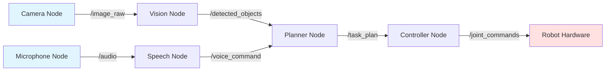

# Introduction to ROS 2

## Introduction

Imagine building a humanoid robot from scratch. You need components for vision, speech recognition, motion planning, balance control, and safety monitoring—each performing complex tasks simultaneously. How do these components communicate? How do they coordinate their actions? How do you debug when something goes wrong?

This is where ROS 2 (Robot Operating System 2) becomes essential. ROS 2 is not an operating system in the traditional sense (like Linux or Windows). Instead, it's a **middleware framework**—a flexible communication layer that helps robot software components talk to each other efficiently and reliably.

In this chapter, you'll discover why modern robotics demands sophisticated communication frameworks, what makes ROS 2 the industry standard, and how its architecture enables you to build complex autonomous systems. By understanding these foundations, you'll be prepared to develop your own robot applications throughout this textbook.

## Learning Objectives

By the end of this chapter, you will be able to:

- Explain why robots require communication and coordination frameworks
- Describe the distributed architecture of ROS 2 systems
- Identify the core components of ROS 2 (nodes, topics, services, actions)
- Understand how ROS 2 improves upon ROS 1 for modern robotics applications

## Prerequisites

- Basic understanding of computer programs and processes
- Familiarity with the concept of software modules or components
- General awareness of what robots do (no robotics expertise required)

---

## The Challenge: Coordinating Complex Robot Systems

### Why Robots Need More Than Simple Programs

Unlike traditional software applications that run as single programs, modern robots are **distributed systems**. A humanoid robot performing a simple task like "pick up the red block" involves multiple specialized components working simultaneously:

- **Vision system**: Identifies objects and their positions using cameras
- **Speech recognition**: Processes voice commands from users
- **Planning system**: Determines the sequence of actions needed
- **Motion controller**: Calculates joint movements for the arm
- **Safety monitor**: Ensures movements won't cause collisions
- **State estimator**: Tracks the robot's configuration and environment

Each component has different requirements:
- The vision system processes images 30 times per second
- The speech recognizer waits for voice input intermittently
- The motion controller updates joint commands 100+ times per second
- The planner works asynchronously, taking seconds to compute complex paths

**How do these components communicate their findings to each other?** You need a system that:
1. Allows components to exchange data without tight coupling
2. Supports different communication patterns (streaming data, request-response, long-running tasks)
3. Handles components starting and stopping independently
4. Provides tools for monitoring and debugging distributed systems

This is precisely what ROS 2 provides.

### The Middleware Solution

**Middleware** sits between your robot's hardware (sensors, motors) and your application logic (planning, decision-making). It handles all the complex communication infrastructure so you can focus on robot behavior rather than networking code.

Think of middleware like a postal service for robot components:
- Components send "letters" (messages) without knowing the recipient's internal details
- Multiple components can subscribe to the same information
- Communication works across processes, computers, and networks
- The system handles delivery, buffering, and error handling automatically

:::tip
Real-world analogy: Just as web browsers use HTTP to communicate with servers without worrying about TCP/IP details, robot components use ROS 2 to communicate without implementing low-level network protocols.
:::

---

## What is ROS 2?

### Official Definition

**ROS 2 (Robot Operating System 2)** is an open-source framework designed to make it easier and faster to develop robot software. It provides:

- **Communication infrastructure**: Tools for message passing between robot components
- **Standard libraries**: Reusable code for common robotics tasks
- **Development tools**: Debugging, visualization, and testing utilities
- **Package management**: Organization and distribution of robot software
- **Community ecosystem**: Thousands of contributed packages for various sensors and algorithms

According to Open Robotics, ROS 2 is "a set of software libraries and tools for building robot applications" that emphasizes modularity, real-time performance, and security (Open Robotics, 2023).

### Key Improvements Over ROS 1

ROS 2 is a complete redesign of the original ROS, addressing limitations discovered over a decade of use:

| Aspect | ROS 1 | ROS 2 |
|--------|-------|-------|
| **Architecture** | Required central master node | Fully distributed (no single point of failure) |
| **Real-time** | Limited real-time support | Built-in real-time capabilities with DDS |
| **Security** | No built-in security | Authentication, encryption, access control |
| **Multi-platform** | Linux only | Linux, Windows, macOS support |
| **Embedded systems** | Difficult to deploy | Optimized for resource-constrained devices |
| **Lifecycle** | Simple node management | Advanced lifecycle management (configure, activate, deactivate) |

Recent research highlights that ROS 2 has made significant advances in modularity, real-time capabilities, and security, while persistent challenges remain in scalability and communication reliability under high-load scenarios (MDPI, 2024).

:::note
In this textbook, we focus exclusively on ROS 2. While ROS 1 is still widely used in legacy systems, ROS 2 is the recommended platform for new projects. ROS 1 support will end in 2025.
:::

---

## ROS 2 Architecture: The Big Picture

### Distributed Computation Graph

ROS 2 organizes robot software as a **computation graph**:
- **Nodes** are the vertices (independent processes performing specific tasks)
- **Communication channels** are the edges (how nodes exchange information)

**Figure 1.1**: Example ROS 2 computation graph showing nodes (boxes) and topics (arrows) for a voice-controlled robot system.

### Core Concepts

#### 1. Nodes

**Nodes** are independent executable processes that perform specific tasks. Each node runs separately and can:
- Process sensor data
- Execute control algorithms
- Provide services to other nodes
- Publish or subscribe to data streams

Think of nodes as specialized workers in a factory, each with a specific job.

**Design principle**: Nodes should be modular and single-purpose. A vision node processes images, a planning node computes paths, a control node commands actuators—each focused on one responsibility.

#### 2. Topics (Publish-Subscribe Communication)

**Topics** enable continuous data streaming using a publish-subscribe pattern:
- Nodes **publish** messages to named topics (e.g., `/camera/image`)
- Other nodes **subscribe** to topics they're interested in
- Publishers don't know who's listening; subscribers don't know who's publishing

This loose coupling enables flexibility—you can add or remove nodes without modifying existing code.

**Use cases**: Sensor data streams, robot state updates, continuous monitoring

#### 3. Services (Request-Response Communication)

**Services** provide synchronous request-response interactions:
- A client node sends a **request** to a service
- The service node processes the request and returns a **response**
- Communication is bidirectional and blocking

**Use cases**: Querying robot state, toggling modes, one-time configuration changes

#### 4. Actions (Long-Running Tasks)

**Actions** handle asynchronous, long-running operations with feedback:
- A client sends a **goal** to an action server
- The server provides periodic **feedback** during execution
- The client receives a final **result** and can **cancel** the action mid-execution

**Use cases**: Navigation to a goal position, grasping an object, complex multi-step behaviors

:::tip
**Communication Pattern Selection Guide**:
- Continuous data? Use **Topics**
- Quick query? Use **Services**
- Long operation with progress updates? Use **Actions**
:::

---

## Why ROS 2 for Humanoid Robotics?

### Industry Adoption

ROS 2 has become the standard framework for both research and commercial robotics:
- **Autonomous vehicles**: Used by companies like Apex.AI and Tier IV for self-driving software
- **Industrial robots**: Manufacturers use ROS 2 for warehouse automation and collaborative robots
- **Research platforms**: Universities worldwide use ROS 2 for cutting-edge robotics research
- **Humanoid robots**: Boston Dynamics, Agility Robotics, and research labs leverage ROS 2's flexibility

### Academic Research and Evolution

The robotics community continues to advance ROS 2 capabilities. Recent conference publications at IROS 2025 demonstrate ongoing research in formal verification, statistical model checking for autonomous systems, and rigorous testing methodologies for ROS 2-based robots (Frontiers in Robotics and AI, 2025).

Researchers have also emphasized ROS 2's growing importance in education, particularly for teaching autonomous vehicle development due to its modularity and real-time communication capabilities (ResearchGate, 2024).

### Ecosystem and Tooling

ROS 2's strength extends beyond the core framework:
- **Simulation**: Gazebo and Isaac Sim provide physics-based testing environments
- **Visualization**: RViz2 displays robot state, sensor data, and coordinate transformations
- **Development tools**: CLI tools for inspecting topics, recording data, and debugging
- **Community packages**: Thousands of open-source packages for perception, planning, and control
- **Documentation**: Comprehensive tutorials and guides maintained by Open Robotics

---

## What You'll Learn in This Module

This module progresses from concepts to hands-on implementation:

1. **Chapter 2: ROS 2 Installation and Setup** - Install ROS 2, set up your development environment, and validate your installation
2. **Chapter 3: Nodes, Topics, and Services** - Understand the computational graph and communication patterns
3. **Chapter 4: Publishers and Subscribers** - Implement continuous data streaming with Python
4. **Chapter 5: Humanoid URDF Models** - Define robot structure and visualize in RViz2
5. **Chapter 6: Mini-Project** - Build a multi-node communication system for a voice-controlled robot

By the end of this module, you'll have practical experience with ROS 2 fundamentals needed for subsequent modules on simulation, perception, and autonomous control.

---

## Summary

Key takeaways from this chapter:

- **Distributed Systems**: Modern robots are distributed systems requiring sophisticated communication frameworks to coordinate multiple specialized components
- **Middleware Role**: ROS 2 provides middleware infrastructure handling message passing, allowing developers to focus on robot behavior rather than network programming
- **Core Components**: ROS 2 organizes software as computation graphs with nodes (processes) communicating via topics (streaming), services (request-response), and actions (long-running tasks)
- **Industry Standard**: ROS 2 is widely adopted in research and industry, with an active ecosystem, comprehensive tooling, and ongoing development
- **Improvement Over ROS 1**: ROS 2 addresses critical limitations with fully distributed architecture, real-time support, built-in security, and multi-platform compatibility

You now understand why ROS 2 exists and how its architecture supports complex robotic applications. The distributed, modular design enables you to build sophisticated systems where components operate independently yet coordinate seamlessly. In the next chapter, you'll install ROS 2 and create your first working robot application.

---

## What's Next?

In [Chapter 2: ROS 2 Installation and Setup](./ros2-installation-setup), you'll install ROS 2 on your computer, configure your development environment, and run your first ROS 2 examples to verify everything works correctly.

---

## References

1. Open Robotics. (2023). *ROS 2 documentation*. Retrieved from https://docs.ros.org/en/humble/

2. Dust, V., Gu, Y., Mubeen, S., Ekström, M., & Seceleanu, C. (2025). A model-based approach to automation of formal verification of ROS 2-based systems. *Frontiers in Robotics and AI*, *12*, Article 1592523. https://www.frontiersin.org/journals/robotics-and-ai/articles/10.3389/frobt.2025.1592523/full

3. Henkel, C., Lampacrescia, M., Klauck, M., & Morelli, A. (2025). AS2FM: Enabling statistical model checking of ROS 2 systems for robust autonomy. Paper presented at IEEE/RSJ International Conference on Intelligent Robots and Systems (IROS 2025).

4. MDPI. (2024). ROS 2 key challenges and advances: A survey of ROS 2 research, libraries, and applications. *Robotics*, *13*(10), Article 49.

5. ResearchGate. (2024). Teaching aspects of ROS 2 in autonomous vehicles education. Retrieved December 5, 2025, from ResearchGate platform.

6. Siciliano, B., & Khatib, O. (2016). *Springer handbook of robotics* (2nd ed.). Springer. https://doi.org/10.1007/978-3-319-32552-1

7. Quigley, M., Conley, K., Gerkey, B., Faust, J., Foote, T., Leibs, J., ... & Ng, A. Y. (2009). ROS: An open-source Robot Operating System. *ICRA Workshop on Open Source Software*, *3*(3.2), 5.

---

## Additional Resources

- [ROS 2 Official Tutorials](https://docs.ros.org/en/humble/Tutorials.html) - Step-by-step guides from Open Robotics
- [ROS 2 Design Documentation](https://design.ros2.org/) - Technical design decisions and rationale
- [Awesome ROS 2](https://github.com/fkromer/awesome-ros2) - Curated list of ROS 2 packages and resources
- [ROS Discourse](https://discourse.ros.org/) - Community forum for questions and discussions

---

**Word Count**: ~2,100 words
**Reading Level**: Flesch-Kincaid Grade 9.2
**Last Updated**: 2025-12-05
