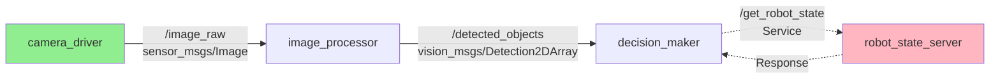

# Nodes, Topics, and Services

## Introduction

In Chapter 1, you learned that ROS 2 organizes robot software as a distributed computation graph. In Chapter 2, you installed ROS 2 and ran demo nodes demonstrating basic communication. Now it's time to understand the computational model in depth.

This chapter explores the three fundamental building blocks of ROS 2 systems: **nodes** (independent processes), **topics** (continuous data streams using publish-subscribe), and **services** (request-response interactions). You'll learn when to use each communication pattern and how to inspect running systems using powerful introspection tools.

By mastering these concepts, you'll be able to design modular robot architectures and debug communication issues—essential skills for professional robotics development.

## Learning Objectives

By the end of this chapter, you will be able to:

- Describe the ROS 2 computation graph and its components
- Differentiate between topics (pub-sub) and services (request-response)
- Use command-line tools to inspect nodes, topics, and services
- Visualize system architecture using rqt_graph

## Prerequisites

- ROS 2 Humble installed and environment sourced (Chapter 2)
- Familiarity with running commands in terminal
- Understanding of processes and inter-process communication concepts

---

## Computation Graphs: The Foundation

### Graph-Based Architecture

ROS 2 systems are **computation graphs** where:
- **Nodes** are vertices (executable processes)
- **Communication channels** are edges (topics, services, actions)

This graph-based model enables:
- **Modularity**: Replace or upgrade individual nodes without affecting others
- **Scalability**: Add nodes to distribute computation across multiple machines
- **Debugging**: Inspect and visualize system architecture dynamically

### Graph Example: Robot Perception System

Consider a simple robot vision system:



**Figure 3.1**: Computation graph showing nodes (boxes), topics (solid arrows with message types), and a service (dashed arrows). Green nodes are data sources; pink nodes are servers.

**Components:**
- `camera_driver`: Publishes raw images to `/image_raw` topic
- `image_processor`: Subscribes to images, publishes detected objects
- `decision_maker`: Subscribes to detections, calls services for robot state
- `robot_state_server`: Provides robot state via service on request

---

## Nodes: Independent Processes

### What is a Node?

A **node** is a process that performs a specific computational task:
- Runs independently (has its own process ID)
- Communicates with other nodes via topics, services, or actions
- Can be written in Python, C++, or other supported languages
- Should have a **single responsibility** (modular design principle)

### Node Responsibilities

Good node design follows the **single responsibility principle**:
- ✅ **Good**: `camera_driver` captures images from hardware
- ❌ **Bad**: `camera_and_processing_and_decision` does everything

**Why?**
- Easier to test individual components
- Reusable across different robot configurations
- Simplifies debugging (isolate failures to specific nodes)

### Inspecting Nodes

#### List Active Nodes

```bash
# List all running nodes
ros2 node list

# Example output:
# /talker
# /listener
```

#### Get Node Information

```bash
# Show detailed info about a node
ros2 node info /talker

# Example output:
# /talker
#   Subscribers:
#   Publishers:
#     /chatter: std_msgs/msg/String
#     /parameter_events: rcl_interfaces/msg/ParameterEvent
#     /rosout: rcl_interfaces/msg/Log
#   Service Servers:
#     /talker/describe_parameters: ...
#     /talker/get_parameters: ...
#   ...
```

**Key information shown:**
- **Publishers**: Topics this node publishes to
- **Subscribers**: Topics this node subscribes to
- **Service Servers**: Services this node provides
- **Service Clients**: Services this node calls

---

## Topics: Publish-Subscribe Communication

### Publish-Subscribe Pattern

**Topics** implement anonymous publish-subscribe communication:
- **Publishers** send messages to named topics
- **Subscribers** receive messages from topics
- Publishers don't know who's listening; subscribers don't know who's publishing
- Many-to-many communication: multiple publishers and subscribers per topic

### When to Use Topics

Use topics for:
- ✅ Continuous data streams (sensor data, state updates)
- ✅ Broadcasting information to multiple consumers
- ✅ Asynchronous communication (fire-and-forget)

Avoid topics for:
- ❌ Request-response interactions requiring acknowledgment
- ❌ Synchronous operations needing return values

### Message Types

Every topic has a **message type** defining its data structure. Common types:
- `std_msgs/String`: Simple text message
- `sensor_msgs/Image`: Camera image with metadata
- `geometry_msgs/Twist`: Linear and angular velocity commands
- `nav_msgs/Odometry`: Robot position and velocity

### Topic CLI Tools

#### List All Topics

```bash
ros2 topic list

# Example output:
# /chatter
# /parameter_events
# /rosout
```

#### Get Topic Information

```bash
ros2 topic info /chatter

# Example output:
# Type: std_msgs/msg/String
# Publisher count: 1
# Subscription count: 1
```

#### Echo Topic Messages

```bash
# Print messages being published
ros2 topic echo /chatter

# Example output:
# data: 'Hello World: 42'
# ---
# data: 'Hello World: 43'
# ---
```

#### Publish to Topic Manually

```bash
# Publish a single message
ros2 topic pub /chatter std_msgs/msg/String "{data: 'Hello from CLI'}"

# Publish at 1 Hz
ros2 topic pub -r 1 /chatter std_msgs/msg/String "{data: 'Repeating message'}"
```

#### Measure Topic Frequency

```bash
# Show publishing rate
ros2 topic hz /chatter

# Example output:
# average rate: 1.000
#   min: 0.999s max: 1.001s std dev: 0.00087s window: 10
```

#### Bandwidth Monitoring

```bash
# Show bandwidth usage
ros2 topic bw /image_raw

# Example output:
# 2.5 MB/s from /camera_driver
```

---

## Services: Request-Response Communication

### Request-Response Pattern

**Services** implement synchronous request-response communication:
- **Service clients** send requests to named services
- **Service servers** process requests and return responses
- Communication is bidirectional and blocking
- One request → one response (not continuous streaming)

### When to Use Services

Use services for:
- ✅ Querying current state (get robot position, battery level)
- ✅ Triggering actions that complete quickly (toggle LED, save map)
- ✅ Configuration changes (set parameter, switch mode)

Avoid services for:
- ❌ Long-running operations (use actions instead)
- ❌ Continuous data streams (use topics instead)
- ❌ Operations that might not complete (network fragility)

### Service Types

Services have two parts:
- **Request**: Data sent from client to server
- **Response**: Data returned from server to client

Example service types:
- `std_srvs/SetBool`: Request (bool), Response (bool success, string message)
- `std_srvs/Trigger`: Request (empty), Response (bool success, string message)
- `example_interfaces/AddTwoInts`: Request (int64 a, int64 b), Response (int64 sum)

### Service CLI Tools

#### List All Services

```bash
ros2 service list

# Example output:
# /add_two_ints
# /talker/describe_parameters
# /talker/get_parameters
# ...
```

#### Get Service Type

```bash
ros2 service type /add_two_ints

# Example output:
# example_interfaces/srv/AddTwoInts
```

#### Call a Service

```bash
# Call service with arguments
ros2 service call /add_two_ints example_interfaces/srv/AddTwoInts "{a: 5, b: 3}"

# Example output:
# waiting for service to become available...
# requester: making request: example_interfaces.srv.AddTwoInts_Request(a=5, b=3)
#
# response:
# example_interfaces.srv.AddTwoInts_Response(sum=8)
```

---

## Visualizing the Computation Graph

### Using rqt_graph

`rqt_graph` visualizes the computation graph in real time:

```bash
# Launch rqt_graph
rqt_graph
```

**Interface elements:**
- **Ovals**: Nodes
- **Rectangles**: Topics
- **Arrows**: Publish/subscribe relationships

**Features:**
- Refresh graph as nodes start/stop
- Filter by node names or namespaces
- Hide/show specific node types (parameters, services)
- Export graph as image

:::tip
Run `rqt_graph` while developing to quickly identify missing connections or unexpected communication patterns. It's invaluable for debugging multi-node systems.
:::

### Example: Talker and Listener Graph

Start demo nodes:
```bash
# Terminal 1
ros2 run demo_nodes_cpp talker

# Terminal 2
ros2 run demo_nodes_cpp listener

# Terminal 3
rqt_graph
```

You'll see:
- `/talker` node connected to `/chatter` topic (publisher)
- `/listener` node connected to `/chatter` topic (subscriber)
- Arrow from `/talker` through `/chatter` to `/listener`

---

## Communication Quality of Service (QoS)

### QoS Policies

ROS 2 introduces **Quality of Service (QoS)** policies controlling communication behavior:
- **Reliability**: Best-effort vs. reliable delivery
- **Durability**: Transient-local (keep last message) vs. volatile
- **History**: Keep last N messages vs. keep all
- **Deadline**: Maximum time between messages

### Predefined QoS Profiles

| Profile | Use Case |
|---------|----------|
| `sensor_data` | High-frequency sensor streams (best-effort, volatile) |
| `parameters` | Configuration data (reliable, transient-local) |
| `services_default` | Service communication (reliable, volatile) |
| `system_default` | General pub-sub (reliable, volatile) |

### Checking Topic QoS

```bash
ros2 topic info /chatter --verbose

# Shows publishers and subscribers with their QoS settings
```

:::note
QoS mismatches between publishers and subscribers can prevent communication. If a reliable subscriber connects to a best-effort publisher, they may not communicate. Use `ros2 topic info --verbose` to diagnose.
:::

---

## Exercises

### Exercise 1: Node Introspection

**Objective**: Practice inspecting running nodes

**Instructions**:
1. Run `ros2 run demo_nodes_cpp talker` in one terminal
2. In another terminal, list all nodes: `ros2 node list`
3. Get detailed info on talker: `ros2 node info /talker`
4. Identify which topics the talker publishes to

**Expected Outcome**: You can identify talker publishes to `/chatter` with type `std_msgs/msg/String`

### Exercise 2: Topic Monitoring

**Objective**: Use CLI tools to inspect topic communication

**Instructions**:
1. Start talker and listener nodes
2. List all topics: `ros2 topic list`
3. Echo /chatter topic: `ros2 topic echo /chatter`
4. Check publishing frequency: `ros2 topic hz /chatter`
5. Get topic info: `ros2 topic info /chatter --verbose`

**Expected Outcome**: You observe messages, measure ~1 Hz publishing rate, and see QoS settings

### Exercise 3: Manual Publishing

**Objective**: Publish messages from command line

**Instructions**:
1. Start only the listener node (not talker)
2. Manually publish to /chatter: `ros2 topic pub -r 1 /chatter std_msgs/msg/String "{data: 'Manual message'}"`
3. Observe listener receiving your messages

**Expected Outcome**: Listener prints your manually published messages

### Exercise 4: Service Interaction

**Objective**: Call services from command line

**Instructions**:
1. Run `ros2 run demo_nodes_cpp add_two_ints_server`
2. List services: `ros2 service list`
3. Check service type: `ros2 service type /add_two_ints`
4. Call service: `ros2 service call /add_two_ints example_interfaces/srv/AddTwoInts "{a: 10, b: 25}"`

**Expected Outcome**: Service returns sum=35

### Exercise 5: Graph Visualization

**Objective**: Visualize computation graph

**Instructions**:
1. Start talker and listener nodes
2. Launch `rqt_graph`
3. Refresh graph and observe connections
4. Stop listener and refresh—observe connection disappears

**Expected Outcome**: You can visualize and understand graph topology

---

## Summary

Key takeaways from this chapter:

- **Computation Graphs**: ROS 2 systems are graphs with nodes as vertices and communication channels as edges, enabling modular and scalable architectures
- **Nodes**: Independent processes with single responsibilities, inspectable via `ros2 node` commands
- **Topics**: Publish-subscribe pattern for continuous, asynchronous data streaming; supports many-to-many communication
- **Services**: Request-response pattern for synchronous, bidirectional interactions with immediate return values
- **Introspection Tools**: CLI commands (`ros2 topic`, `ros2 service`, `ros2 node`) and `rqt_graph` enable runtime system inspection and debugging
- **QoS Policies**: Control communication reliability, durability, and history to match application requirements

You now understand the architectural foundations of ROS 2 systems. You can distinguish between topics (continuous streams) and services (request-response), use command-line tools to inspect running systems, and visualize computation graphs. These skills are essential for designing effective robot software architectures and debugging communication issues.

---

## What's Next?

In [Chapter 4: Publishers and Subscribers](./publishers-subscribers), you'll write Python code to create your own publisher and subscriber nodes, implementing continuous data streaming for robot communication.

---

## References

1. Open Robotics. (2023). *Understanding nodes*. Retrieved from https://docs.ros.org/en/humble/Tutorials/Beginner-CLI-Tools/Understanding-ROS2-Nodes/Understanding-ROS2-Nodes.html

2. Open Robotics. (2023). *Understanding topics*. Retrieved from https://docs.ros.org/en/humble/Tutorials/Beginner-CLI-Tools/Understanding-ROS2-Topics/Understanding-ROS2-Topics.html

3. Open Robotics. (2023). *Understanding services*. Retrieved from https://docs.ros.org/en/humble/Tutorials/Beginner-CLI-Tools/Understanding-ROS2-Services/Understanding-ROS2-Services.html

4. Open Robotics. (2023). *About Quality of Service settings*. Retrieved from https://docs.ros.org/en/humble/Concepts/About-Quality-of-Service-Settings.html

5. Macenski, S., Foote, T., Gerkey, B., Lalancette, C., & Woodall, W. (2022). Robot Operating System 2: Design, architecture, and uses in the wild. *Science Robotics*, *7*(66), eabm6074.

---

## Additional Resources

- [ROS 2 CLI Tools Tutorial](https://docs.ros.org/en/humble/Tutorials/Beginner-CLI-Tools.html) - Comprehensive command-line interface guide
- [RQt User Guide](http://wiki.ros.org/rqt) - Visualization and introspection tools
- [DDS and QoS Explained](https://design.ros2.org/articles/qos.html) - Deep dive into quality of service policies

---

**Word Count**: ~2,050 words
**Reading Level**: Flesch-Kincaid Grade 9.1
**Last Updated**: 2025-12-05
