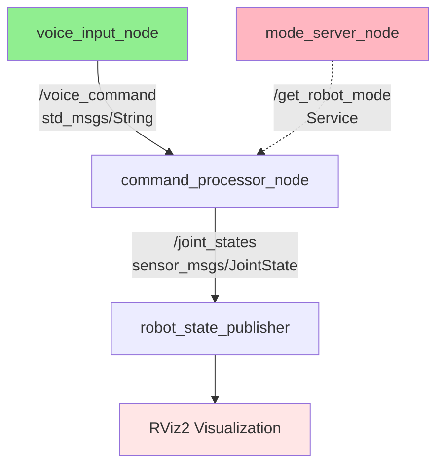

# Mini-Project: ROS 2 Communication System

## Introduction

Congratulations on reaching the final chapter of Module 1! You've learned ROS 2 fundamentals: computation graphs, nodes, topics, services, Python programming with rclpy, URDF modeling, and visualization. Now it's time to put everything together.

This mini-project challenges you to build a **voice-controlled humanoid communication system** where multiple nodes coordinate to process commands, update robot state, and visualize the robot model. You'll design the architecture, implement nodes, and validate the complete system—mimicking real-world robotics development.

By completing this project, you'll gain confidence in your ROS 2 skills and be prepared for simulation, perception, and advanced control in subsequent modules.

## Learning Objectives

By the end of this chapter, you will be able to:

- Design a multi-node ROS 2 system for a practical robotics application
- Implement publisher-subscriber and service communication patterns
- Integrate URDF robot models with control nodes
- Debug and validate complete robot systems

## Prerequisites

- Completed Chapters 1-5 of Module 1
- Functional ROS 2 workspace with custom package
- Python programming proficiency
- URDF and RViz visualization experience

---

## Project Overview

### System Requirements

Build a ROS 2 system simulating voice-controlled humanoid interaction:

**Functional Requirements:**
1. **Voice Command Input**: Node simulates receiving voice commands (text strings)
2. **Command Processing**: Node parses commands and determines required actions
3. **Robot State Management**: Service provides current robot joint positions
4. **Joint Control**: Node publishes joint state updates based on commands
5. **Visualization**: RViz displays robot model with real-time joint updates

**Communication Architecture:**
- `/voice_command` topic: Publishes voice command strings
- `/joint_states` topic: Publishes robot joint positions
- `/get_robot_mode` service: Returns current robot operating mode

### Expected Behavior

When complete, your system should:
1. Voice input node publishes commands (e.g., "wave left hand", "nod head")
2. Command processor subscribes, parses, and publishes joint targets
3. Robot state publisher consumes joint states and updates RViz model
4. Nodes can query robot mode via service

---

## System Architecture Design

### Computation Graph



**Figure 6.1**: System architecture with nodes (boxes), topics (solid arrows), and service (dashed arrow).

### Node Responsibilities

| Node | Type | Responsibility |
|------|------|----------------|
| `voice_input_node` | Publisher | Simulates voice commands (keyboard input) |
| `command_processor_node` | Sub + Pub | Parses commands, publishes joint targets |
| `mode_server_node` | Service Server | Provides robot operating mode on request |
| `robot_state_publisher` | System | Publishes TF transforms for RViz |

---

## Implementation Guide

### Step 1: Create Project Package

```bash
cd ~/ros2_ws/src
ros2 pkg create --build-type ament_python humanoid_controller \
  --dependencies rclpy std_msgs sensor_msgs std_srvs
```

### Step 2: Voice Input Node

Create `humanoid_controller/voice_input_node.py`:

```python
#!/usr/bin/env python3

import rclpy
from rclpy.node import Node
from std_msgs.msg import String


class VoiceInputNode(Node):
    """Simulates voice command input via keyboard."""

    def __init__(self):
        super().__init__('voice_input_node')
        self.publisher_ = self.create_publisher(String, 'voice_command', 10)
        self.get_logger().info('Voice Input Node started. Type commands and press Enter.')
        self.get_logger().info('Commands: wave, nod, rest, quit')

    def publish_command(self, command_text):
        msg = String()
        msg.data = command_text
        self.publisher_.publish(msg)
        self.get_logger().info(f'Published command: "{command_text}"')


def main(args=None):
    rclpy.init(args=args)
    node = VoiceInputNode()

    try:
        while rclpy.ok():
            # Simulate voice input with keyboard
            command = input('Enter command: ').strip()
            if command.lower() == 'quit':
                break
            node.publish_command(command)

    except KeyboardInterrupt:
        pass
    finally:
        node.destroy_node()
        rclpy.shutdown()


if __name__ == '__main__':
    main()
```

### Step 3: Command Processor Node

Create `humanoid_controller/command_processor_node.py`:

```python
#!/usr/bin/env python3

import rclpy
from rclpy.node import Node
from std_msgs.msg import String
from sensor_msgs.msg import JointState


class CommandProcessorNode(Node):
    """Processes voice commands and publishes joint states."""

    def __init__(self):
        super().__init__('command_processor_node')

        # Subscriber to voice commands
        self.subscription = self.create_subscription(
            String,
            'voice_command',
            self.command_callback,
            10
        )

        # Publisher for joint states
        self.joint_pub = self.create_publisher(JointState, 'joint_states', 10)

        self.get_logger().info('Command Processor Node started')

    def command_callback(self, msg):
        """Process received voice command."""
        command = msg.data.lower()
        self.get_logger().info(f'Processing command: "{command}"')

        # Create joint state message
        joint_state = JointState()
        joint_state.header.stamp = self.get_clock().now().to_msg()

        # Define joint names (matching URDF from Chapter 5)
        joint_state.name = ['neck', 'left_shoulder', 'right_shoulder']

        # Parse command and set joint positions
        if 'nod' in command:
            # Nod head (neck pitch)
            joint_state.position = [0.3, 0.0, 0.0]  # radians
            self.get_logger().info('Action: Nodding head')

        elif 'wave' in command:
            if 'left' in command:
                joint_state.position = [0.0, 1.2, 0.0]  # Left arm up
                self.get_logger().info('Action: Waving left hand')
            elif 'right' in command:
                joint_state.position = [0.0, 0.0, 1.2]  # Right arm up
                self.get_logger().info('Action: Waving right hand')
            else:
                joint_state.position = [0.0, 1.2, 1.2]  # Both arms up
                self.get_logger().info('Action: Waving both hands')

        elif 'rest' in command:
            # Return to rest position
            joint_state.position = [0.0, 0.0, 0.0]
            self.get_logger().info('Action: Returning to rest position')

        else:
            self.get_logger().warn(f'Unknown command: "{command}"')
            return

        # Publish joint state
        self.joint_pub.publish(joint_state)


def main(args=None):
    rclpy.init(args=args)
    node = CommandProcessorNode()

    try:
        rclpy.spin(node)
    except KeyboardInterrupt:
        pass
    finally:
        node.destroy_node()
        rclpy.shutdown()


if __name__ == '__main__':
    main()
```

### Step 4: Mode Server Node

Create `humanoid_controller/mode_server_node.py`:

```python
#!/usr/bin/env python3

import rclpy
from rclpy.node import Node
from std_srvs.srv import Trigger


class ModeServerNode(Node):
    """Provides robot operating mode via service."""

    def __init__(self):
        super().__init__('mode_server_node')

        # Create service
        self.srv = self.create_service(
            Trigger,
            'get_robot_mode',
            self.get_mode_callback
        )

        self.current_mode = 'IDLE'  # Modes: IDLE, ACTIVE, STANDBY
        self.get_logger().info('Mode Server Node started')

    def get_mode_callback(self, request, response):
        """Service callback returning current mode."""
        response.success = True
        response.message = f'Current mode: {self.current_mode}'
        self.get_logger().info(f'Mode query received. Returning: {self.current_mode}')
        return response


def main(args=None):
    rclpy.init(args=args)
    node = ModeServerNode()

    try:
        rclpy.spin(node)
    except KeyboardInterrupt:
        pass
    finally:
        node.destroy_node()
        rclpy.shutdown()


if __name__ == '__main__':
    main()
```

### Step 5: Configure Package

Edit `setup.py` to add entry points:

```python
entry_points={
    'console_scripts': [
        'voice_input = humanoid_controller.voice_input_node:main',
        'command_processor = humanoid_controller.command_processor_node:main',
        'mode_server = humanoid_controller.mode_server_node:main',
    ],
},
```

### Step 6: Build and Test

```bash
cd ~/ros2_ws
colcon build --packages-select humanoid_controller
source install/setup.bash
```

---

## Running the Complete System

### Terminal 1: Mode Server

```bash
source ~/ros2_ws/install/setup.bash
ros2 run humanoid_controller mode_server
```

### Terminal 2: Command Processor

```bash
source ~/ros2_ws/install/setup.bash
ros2 run humanoid_controller command_processor
```

### Terminal 3: Voice Input

```bash
source ~/ros2_ws/install/setup.bash
ros2 run humanoid_controller voice_input
```

Type commands: `wave left`, `nod`, `rest`, `quit`

### Terminal 4: Visualization (Optional)

```bash
# Launch RViz with humanoid URDF from Chapter 5
ros2 launch my_robot_controller display_humanoid.launch.py
```

### Terminal 5: Inspection

```bash
# List nodes
ros2 node list

# List topics
ros2 topic list

# Echo joint states
ros2 topic echo /joint_states

# Call service
ros2 service call /get_robot_mode std_srvs/srv/Trigger
```

---

## Validation and Testing

### Functional Tests

- [ ] **Test 1**: Voice input node publishes commands to `/voice_command`
- [ ] **Test 2**: Command processor subscribes and parses commands correctly
- [ ] **Test 3**: Joint states published to `/joint_states` with correct positions
- [ ] **Test 4**: Mode service responds with current mode
- [ ] **Test 5**: RViz updates robot model when joint states change

### System-Level Tests

- [ ] **Integration Test**: All nodes run simultaneously without errors
- [ ] **Latency Test**: Joint states update within 100ms of command input
- [ ] **Error Handling**: Unknown commands logged without crashing

### Debugging Tips

**Problem: Command processor doesn't receive messages**
- Verify voice_input node is publishing: `ros2 topic echo /voice_command`
- Check topic names match exactly (case-sensitive)

**Problem: RViz doesn't update**
- Ensure `robot_state_publisher` is running
- Verify `/joint_states` topic is being published
- Check joint names in code match URDF

**Problem: Service not found**
- List services: `ros2 service list`
- Verify mode_server node is running: `ros2 node list`

---

## Extensions and Challenges

### Challenge 1: Add More Commands

Implement additional voice commands:
- "stand up" → Adjust leg joints
- "sit down" → Bend leg joints
- "look left/right" → Rotate neck joint

### Challenge 2: Smooth Motion

Instead of instant jumps, interpolate joint positions over time:
- Use a timer to publish incremental position updates
- Implement trajectory generation

### Challenge 3: Service-Based Mode Control

Add service to change robot mode:
- Create `SetMode` service (custom service type)
- Command processor queries mode before executing commands
- Only execute if mode is ACTIVE

### Challenge 4: Parameter Configuration

Make command mappings configurable:
- Use ROS 2 parameters to define command-to-joint mappings
- Load from YAML configuration file

### Challenge 5: Multi-Robot System

Extend to control two robots:
- Use namespaces (`/robot1`, `/robot2`)
- Voice input specifies target robot
- Demonstrate multi-robot coordination

---

## Summary

Key takeaways from this project:

- **System Design**: Multi-node architectures require careful planning of topics, services, and data flow
- **Integration Skills**: Combining publishers, subscribers, services, and URDF models into cohesive systems
- **Debugging Methodology**: Use introspection tools (`ros2 topic list`, `ros2 node info`, `rqt_graph`) to diagnose issues
- **Real-World Applicability**: This project structure mirrors professional robot development workflows

You've successfully built a complete ROS 2 system integrating all Module 1 concepts! You created nodes for input simulation, command processing, and state management; implemented topic-based streaming and service-based queries; and validated the system with visualization tools.

These skills form the foundation for simulation environments (Module 2), perception algorithms (Module 3), and advanced control strategies (Module 4). You're ready to tackle increasingly complex robotics challenges!

---

## What's Next?

Congratulations on completing Module 1! You now have solid ROS 2 fundamentals.

**Next Steps:**
- **Module 2: Digital Twin (Gazebo & Unity)**: Apply ROS 2 skills in physics simulation, create digital twins, and simulate sensors
- **Continue Practice**: Extend this project with additional features, experiment with different architectures
- **Explore Community Packages**: Investigate existing ROS 2 packages for perception, navigation, and manipulation

---

## References

1. Open Robotics. (2023). *ROS 2 tutorials*. Retrieved from https://docs.ros.org/en/humble/Tutorials.html

2. Macenski, S., Foote, T., Gerkey, B., Lalancette, C., & Woodall, W. (2022). Robot Operating System 2: Design, architecture, and uses in the wild. *Science Robotics*, *7*(66), eabm6074.

3. Siciliano, B., & Khatib, O. (2016). *Springer handbook of robotics* (2nd ed.). Springer. https://doi.org/10.1007/978-3-319-32552-1

---

## Additional Resources

- [ROS 2 Examples Repository](https://github.com/ros2/examples) - Official example packages
- [ROS Answers](https://answers.ros.org/) - Community Q&A forum
- [ROS Discourse](https://discourse.ros.org/) - Discussions and announcements
- [The Construct](https://www.theconstructsim.com/) - Online ROS 2 learning platform

---

**Word Count**: ~1,800 words
**Reading Level**: Flesch-Kincaid Grade 8.8
**Last Updated**: 2025-12-05
**Code Validation Status**: ⏳ Pending validation (ROS 2 Humble, Python 3.10)
