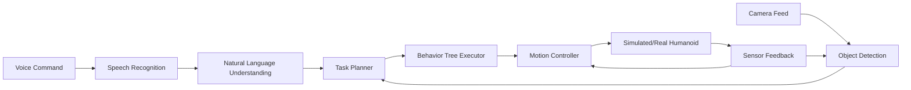

# Introduction to the Capstone Project

## Learning Objectives

By the end of this capstone project, you will be able to:

1. **Integrate** all four modules (ROS 2, Simulation, Perception, Control) into a cohesive robotic system
2. **Design** an end-to-end architecture for a voice-controlled humanoid robot
3. **Implement** multi-modal perception combining vision and speech recognition
4. **Deploy** a complete autonomous system capable of understanding and executing natural language commands
5. **Demonstrate** system integration through video documentation and testing

## Overview

Welcome to the **Autonomous Voice-Controlled Humanoid Assistant** capstone project! This is where everything you've learned comes together into a working robotic system.

### What You'll Build

You will create a humanoid robot (simulated or with partial hardware) that can:

- **Listen** to voice commands using speech recognition
- **See** and understand its environment using computer vision
- **Reason** about tasks using AI-powered planning
- **Act** safely and precisely through ROS 2-based control
- **Respond** with natural language feedback

### Example Interactions

Here are real commands your finished system will handle:

```text
User: "Pick up the red block and place it on the table."
Robot: [Detects red block] → [Plans grasp trajectory] → [Executes motion] → [Confirms completion]

User: "Wave and introduce yourself."
Robot: [Executes wave gesture] → [Speaks: "Hello! I'm your humanoid assistant."]

User: "Navigate to the kitchen."
Robot: [Maps environment] → [Plans path] → [Navigates safely] → [Announces arrival]
```

## Project Architecture

Your capstone system consists of five integrated layers:

### 1. **ROS 2 Foundation Layer** (Module 1)
- Node orchestration and communication
- Topic-based sensor data streaming
- Service-based command interfaces
- Parameter management and configuration

### 2. **Simulation & Digital Twin Layer** (Module 2)
- Gazebo physics simulation environment
- Humanoid URDF model with accurate kinematics
- Sensor simulation (cameras, IMU, joint encoders)
- Real-time visualization and debugging

### 3. **Perception Layer** (Module 3)
- **Vision Pipeline**: Object detection, tracking, and scene understanding
- **Speech Pipeline**: Voice command recognition and natural language processing
- **Sensor Fusion**: Combining multiple data sources for robust perception
- **ROS 2 Integration**: Publishing perception results as topics

### 4. **Planning & Control Layer** (Module 4)
- **Task Planner**: Decomposing high-level commands into executable actions
- **Behavior Trees**: Coordinating complex multi-step behaviors
- **Motion Controller**: PID control and trajectory execution
- **Safety System**: Collision avoidance and constraint enforcement

### 5. **Integration Layer** (Capstone - This Module)
- **System Orchestration**: Coordinating all subsystems
- **State Management**: Tracking robot state across perception, planning, and control
- **Error Handling**: Graceful degradation and recovery
- **Deployment Infrastructure**: Launch files, configuration, and monitoring

## System Data Flow



## Technical Requirements

### Software Stack
- **ROS 2**: Humble or Iron
- **Simulator**: Gazebo Classic or Gazebo Fortress
- **Perception**: OpenCV 4.x, OpenAI Whisper
- **Planning**: py_trees or similar behavior tree library
- **LLM Integration**: OpenAI API or local models
- **Languages**: Python 3.10+, C++ (optional for performance-critical nodes)

### Hardware Requirements (Simulation)
- **CPU**: 4+ cores
- **RAM**: 8 GB minimum (16 GB recommended)
- **GPU**: NVIDIA GPU with CUDA (optional, improves vision processing)
- **Storage**: 20 GB for dependencies and models

### Optional Physical Hardware
- Humanoid robot platform (e.g., Unitree H1, Tesla Optimus, custom build)
- Microphone for voice input
- Camera for vision (if not using simulation)

## Development Workflow

This capstone follows a structured development process:

1. **Phase 1: Setup** - Configure workspace, dependencies, and verification tests
2. **Phase 2: Integration** - Connect Module 1-4 components
3. **Phase 3: Perception Integration** - Unified vision + speech pipeline
4. **Phase 4: Planning Integration** - Task planning and behavior trees
5. **Phase 5: Control Integration** - Motion execution and safety
6. **Phase 6: Testing** - End-to-end validation scenarios
7. **Phase 7: Documentation** - Video demo, README, deployment guide

## Evaluation Criteria

Your capstone project will be assessed on:

### 1. **Technical Correctness** (40%)
- All ROS 2 nodes launch without errors
- Perception systems accurately detect objects and understand commands
- Motion planning generates collision-free, kinematically valid trajectories
- Control system executes motions smoothly and safely

### 2. **System Integration** (30%)
- All four modules work together seamlessly
- State transitions are clean and predictable
- Error handling prevents cascading failures
- System recovers gracefully from unexpected inputs

### 3. **Reliability & Repeatability** (20%)
- System produces consistent results across multiple runs
- Performance metrics (latency, accuracy) meet specified thresholds
- System handles edge cases (unclear commands, occlusions, obstacles)

### 4. **Documentation & Presentation** (10%)
- README provides clear setup instructions
- Code is well-commented and follows best practices
- Video demonstration shows end-to-end capabilities
- Architecture diagrams accurately represent the system

## Success Criteria

Your project is considered complete when:

✅ **A new user can**:
1. Clone your repository
2. Follow your README instructions to install dependencies
3. Launch the simulation environment
4. Issue voice commands like "pick up the red block"
5. Observe the humanoid robot successfully executing the task
6. View your video demonstration showing system capabilities

✅ **The system can**:
1. Recognize at least 5 different voice commands
2. Detect and track at least 3 object classes
3. Generate and execute multi-step task plans
4. Complete tasks with greater than 80% success rate in controlled environments
5. Operate safely without collisions or constraint violations

## What's Next?

In the following chapters, you'll learn:

- **Chapter 2**: Integration strategy for combining all modules
- **Chapter 3**: Setting up the complete simulation environment
- **Chapter 4**: Integrating perception systems (vision + speech)
- **Chapter 5**: Connecting planning and control pipelines
- **Chapter 6**: Implementing the full system with code walkthrough
- **Chapter 7**: Testing and validation procedures
- **Chapter 8**: Recording video demonstrations
- **Chapter 9**: Documentation and deployment best practices

## Mindset for Success

This capstone is challenging but achievable. Keep these principles in mind:

1. **Incremental Development**: Build and test one component at a time
2. **Debug Systematically**: Use ROS 2 tools (`ros2 topic echo`, `rqt_graph`) to isolate issues
3. **Test Early, Test Often**: Validate each integration point before moving forward
4. **Document as You Build**: Future you will thank present you for good notes
5. **Ask for Help**: Robotics is a team sport - leverage community resources

Let's build something amazing! 🤖

---

## Exercises

### Exercise 1: System Requirements Review
List the hardware and software requirements for your specific capstone implementation. Which components will you use? Which are optional for your setup?

### Exercise 2: Architecture Diagram
Draw a detailed architecture diagram showing all ROS 2 nodes, topics, and services you plan to implement. Label the data types and update rates for each topic.

### Exercise 3: Risk Assessment
Identify 5 potential technical risks for your capstone project. For each risk, propose a mitigation strategy.

### Exercise 4: Project Timeline
Create a week-by-week timeline for completing your capstone project. Allocate time for integration, testing, and documentation.

### Exercise 5: Success Metrics
Define quantitative success metrics for your project. Examples:
- Voice command recognition accuracy: greater than 90%
- Object detection recall: greater than 85%
- Task completion rate: greater than 80%
- Average task execution time: less than 30 seconds

---

## Further Reading

- [ROS 2 Composition Best Practices](https://docs.ros.org/en/humble/Concepts/About-Composition.html)
- [Behavior Trees in Robotics (Colledanchise & Ögren, 2018)](https://arxiv.org/abs/1709.00084)
- [OpenAI Whisper Documentation](https://github.com/openai/whisper)
- [Gazebo Integration with ROS 2](https://gazebosim.org/docs/latest/ros2_integration/)
