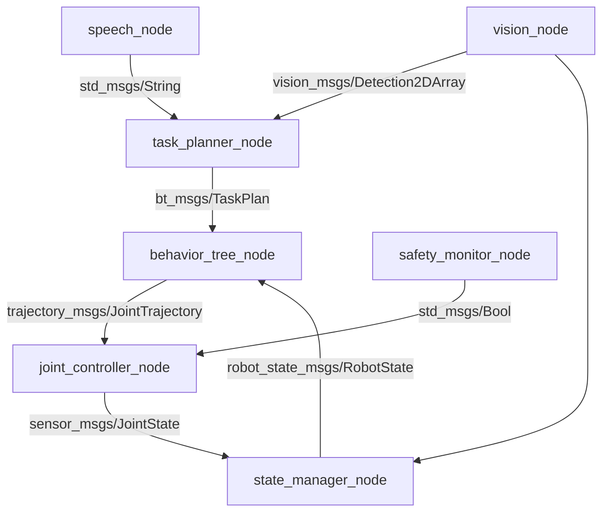

# Integration Strategy

## Overview

Building a working autonomous humanoid requires carefully connecting the four modules you've already mastered. This chapter provides a systematic integration strategy that minimizes debugging time and ensures each component works before moving to the next.

## Integration Challenges

When combining ROS 2, simulation, perception, and control, you'll encounter:

### 1. **Interface Mismatches**
- Different message types between modules
- Incompatible coordinate frames
- Timing inconsistencies (30 Hz vision vs 100 Hz control)

### 2. **State Synchronization**
- Multiple nodes tracking robot state independently
- Race conditions in concurrent systems
- Stale data from slow sensors

### 3. **Dependency Management**
- Module A depends on Module B's output
- Circular dependencies between planning and perception
- Initialization order matters

## Integration Philosophy: Bottom-Up + Horizontal Slicing

We combine two strategies:

**Bottom-Up**: Start with foundational layers (ROS 2, simulation) and add complexity incrementally.

**Horizontal Slicing**: Implement end-to-end "thin slices" of functionality early, then expand.

### Phase 1: Foundation (ROS 2 + Simulation)
✅ **Goal**: Robot model loads and responds to basic commands

**Tasks**:
1. Launch Gazebo with humanoid URDF
2. Verify all joints are controllable
3. Test basic motion commands via `ros2 topic pub`
4. Confirm sensor data streams (camera, IMU, joint states)

**Validation**: Can manually command robot to move joints and see visual feedback in Gazebo.

---

### Phase 2: Thin Vertical Slice (Voice → Motion)
✅ **Goal**: One simple command works end-to-end

**Tasks**:
1. Implement speech recognition node (hardcoded command: "wave")
2. Create simple behavior tree: detect "wave" → trigger wave motion
3. Execute wave motion via joint trajectory controller

**Validation**: Say "wave", robot waves. No object detection, no complex planning—just prove the pipeline works.

---

### Phase 3: Add Vision (Perception Integration)
✅ **Goal**: Robot detects objects and uses vision in decision-making

**Tasks**:
1. Integrate object detection node (e.g., YOLO or MobileNet)
2. Publish detected objects as ROS 2 messages
3. Update behavior tree to check for object presence
4. Test command: "Pick up the red block" (robot detects block before attempting grasp)

**Validation**: Robot refuses command if no red block is visible.

---

### Phase 4: Expand Planning (Complex Task Decomposition)
✅ **Goal**: Handle multi-step tasks with dependencies

**Tasks**:
1. Implement task planner that breaks commands into sub-goals
2. Add behavior tree nodes for navigation, grasping, placing
3. Integrate motion planning library (MoveIt 2 or custom IK solver)

**Validation**: "Pick up the block and place it on the shelf" works correctly.

---

### Phase 5: Robustify (Error Handling + Edge Cases)
✅ **Goal**: System gracefully handles failures

**Tasks**:
1. Add error detection (object out of reach, unclear command, sensor failure)
2. Implement retry logic and fallback behaviors
3. Add voice feedback ("I can't see a red block", "Please repeat")

**Validation**: System doesn't crash on invalid inputs; provides helpful error messages.

---

## ROS 2 Node Architecture

### Recommended Node Structure

```
humanoid_assistant/
├── perception/
│   ├── vision_node.py          # Object detection
│   ├── speech_node.py          # Voice command recognition
│   └── fusion_node.py          # Sensor fusion
├── planning/
│   ├── task_planner_node.py    # High-level task decomposition
│   ├── behavior_tree_node.py   # BT execution
│   └── motion_planner_node.py  # Trajectory generation
├── control/
│   ├── joint_controller_node.py  # Low-level motor control
│   └── safety_monitor_node.py    # Collision/constraint checks
└── integration/
    ├── state_manager_node.py     # Centralized state tracking
    └── launch/
        └── full_system.launch.py # Launch all nodes
```

### Message Flow Diagram



## Interface Contracts

Define strict interfaces between modules:

### 1. **Speech → Planning Interface**
```python
# Topic: /voice_commands
# Message Type: std_msgs/String
# Example: "pick up red block"
# Publishing Rate: On command detection
```

### 2. **Vision → Planning Interface**
```python
# Topic: /detected_objects
# Message Type: vision_msgs/Detection2DArray
# Example: [{class: "block", color: "red", bbox: [...], confidence: 0.95}]
# Publishing Rate: 30 Hz
```

### 3. **Planning → Control Interface**
```python
# Topic: /joint_trajectory
# Message Type: trajectory_msgs/JointTrajectory
# Example: Sequence of joint positions over time
# Publishing Rate: On new plan generation
```

### 4. **Control → State Manager Interface**
```python
# Topic: /joint_states
# Message Type: sensor_msgs/JointState
# Publishing Rate: 100 Hz
```

## Coordinate Frame Management

Critical for perception-control integration:

### Standard Frames
- `world`: Gazebo global frame
- `base_link`: Robot torso center
- `camera_link`: Camera optical frame
- `left_hand`: Left end-effector
- `right_hand`: Right end-effector

### Transform Hierarchy
```
world
└── base_link
    ├── torso
    │   └── head
    │       └── camera_link
    ├── left_shoulder
    │   └── ... → left_hand
    └── right_shoulder
        └── ... → right_hand
```

### Using TF2 for Transforms
```python
import rclpy
from tf2_ros import TransformListener, Buffer

class PerceptionNode(Node):
    def __init__(self):
        super().__init__('perception_node')
        self.tf_buffer = Buffer()
        self.tf_listener = TransformListener(self.tf_buffer, self)

    def transform_to_base_link(self, point_camera_frame):
        try:
            transform = self.tf_buffer.lookup_transform(
                'base_link',
                'camera_link',
                rclpy.time.Time()
            )
            # Apply transform...
            return point_base_frame
        except Exception as e:
            self.get_logger().error(f'Transform failed: {e}')
```

## Timing and Synchronization

### Challenge: Different Update Rates
- Vision: 30 Hz
- Voice Commands: Event-driven
- Control: 100 Hz
- Planning: 1-10 Hz (depends on complexity)

### Solution: Message Filters + ApproximateTimeSynchronizer

```python
from message_filters import ApproximateTimeSynchronizer, Subscriber

class FusionNode(Node):
    def __init__(self):
        super().__init__('fusion_node')

        # Subscribe to vision and joint state
        vision_sub = Subscriber(self, Detection2DArray, '/detected_objects')
        joint_sub = Subscriber(self, JointState, '/joint_states')

        # Synchronize messages within 50ms window
        ts = ApproximateTimeSynchronizer(
            [vision_sub, joint_sub],
            queue_size=10,
            slop=0.05
        )
        ts.registerCallback(self.synchronized_callback)

    def synchronized_callback(self, vision_msg, joint_msg):
        # Process synchronized data
        pass
```

## State Management

### Centralized vs Distributed State

**Centralized** (Recommended for beginners):
- Single `state_manager_node` maintains robot state
- All nodes query/update via services
- Easier to debug, potential bottleneck

**Distributed**:
- Each subsystem maintains local state
- Synchronization via pub/sub
- More complex, better performance

### Example State Manager

```python
class StateManager(Node):
    def __init__(self):
        super().__init__('state_manager')
        self.current_task = None
        self.robot_pose = None
        self.detected_objects = []
        self.joint_states = None

        # Subscribers to update state
        self.create_subscription(String, '/current_task', self.task_callback, 10)
        self.create_subscription(Detection2DArray, '/detected_objects', self.vision_callback, 10)
        self.create_subscription(JointState, '/joint_states', self.joint_callback, 10)

        # Service to query state
        self.create_service(GetRobotState, '/get_robot_state', self.get_state_service)

    def get_state_service(self, request, response):
        response.task = self.current_task
        response.objects = self.detected_objects
        response.joints = self.joint_states
        return response
```

## Configuration Management

### Use ROS 2 Parameters

**config/humanoid_config.yaml**:
```yaml
perception_node:
  ros__parameters:
    camera_topic: "/camera/image_raw"
    detection_threshold: 0.7
    target_objects: ["block", "ball", "cup"]

planning_node:
  ros__parameters:
    planning_timeout: 5.0
    max_retries: 3
    behavior_tree_file: "config/bt_main.xml"

control_node:
  ros__parameters:
    control_rate: 100
    joint_limits:
      shoulder_pitch: [-1.57, 1.57]
      elbow: [0.0, 2.5]
```

Load in launch file:
```python
from launch import LaunchDescription
from launch_ros.actions import Node

def generate_launch_description():
    return LaunchDescription([
        Node(
            package='humanoid_assistant',
            executable='perception_node',
            parameters=['config/humanoid_config.yaml']
        ),
        # ... other nodes
    ])
```

## Testing Strategy

### Unit Tests (Per Module)
Test each module in isolation with mock inputs.

### Integration Tests (Pairs)
1. **ROS 2 + Simulation**: Can we spawn robot and move joints?
2. **Perception + State Manager**: Does vision data reach state manager correctly?
3. **Planning + Control**: Do generated trajectories execute as expected?

### End-to-End Tests
Full system test with real scenarios:
```python
def test_pick_and_place():
    # Setup: Place red block in simulation
    # Action: Issue command "pick up red block"
    # Assert: Block is grasped and lifted
    # Assert: No collisions detected
    # Assert: Task completion status == SUCCESS
```

## Common Integration Issues and Solutions

### Issue 1: "Transform frame doesn't exist"
**Cause**: URDF not loaded or `robot_state_publisher` not running

**Solution**:
```bash
ros2 run robot_state_publisher robot_state_publisher --ros-args -p robot_description:="$(cat robot.urdf)"
```

### Issue 2: "Messages not synchronized"
**Cause**: Timestamps mismatch or clocks not synchronized

**Solution**: Use simulation time in Gazebo:
```python
use_sim_time = LaunchConfiguration('use_sim_time', default='true')
```

### Issue 3: "Planning hangs indefinitely"
**Cause**: Waiting for perception data that never arrives

**Solution**: Add timeout logic:
```python
rclpy.spin_until_future_complete(node, future, timeout_sec=5.0)
if not future.done():
    node.get_logger().error('Perception timeout!')
```

## Integration Checklist

Before declaring integration complete:

- [ ] All ROS 2 nodes launch without errors
- [ ] `ros2 topic list` shows all expected topics
- [ ] `ros2 node list` shows all required nodes
- [ ] `ros2 topic hz /joint_states` confirms expected rates
- [ ] `rqt_graph` visualization matches architecture diagram
- [ ] Transform tree is complete (check `ros2 run tf2_tools view_frames.py`)
- [ ] Manual commands to each subsystem work independently
- [ ] End-to-end test completes successfully
- [ ] Error handling prevents system crashes

## Next Steps

Now that you have an integration strategy, the following chapters will guide you through:
- **Chapter 3**: Setting up the complete Gazebo simulation environment
- **Chapter 4**: Implementing unified perception pipeline
- **Chapter 5**: Building planning and control integration
- **Chapter 6**: Complete system implementation with code

---

## Exercises

### Exercise 1: Draw Your Integration Plan
Create a phased integration diagram for your specific capstone. Include checkpoints and validation criteria for each phase.

### Exercise 2: Define Message Contracts
For your system, define the ROS 2 topics, message types, and expected publish rates for all inter-module communication.

### Exercise 3: Timing Analysis
Calculate the worst-case end-to-end latency from voice command to motion execution. Identify bottlenecks.

### Exercise 4: Error Scenario Planning
List 10 potential failure scenarios and design recovery strategies for each.

### Exercise 5: Write Integration Tests
Implement one integration test that validates two modules working together (e.g., vision + state manager).
