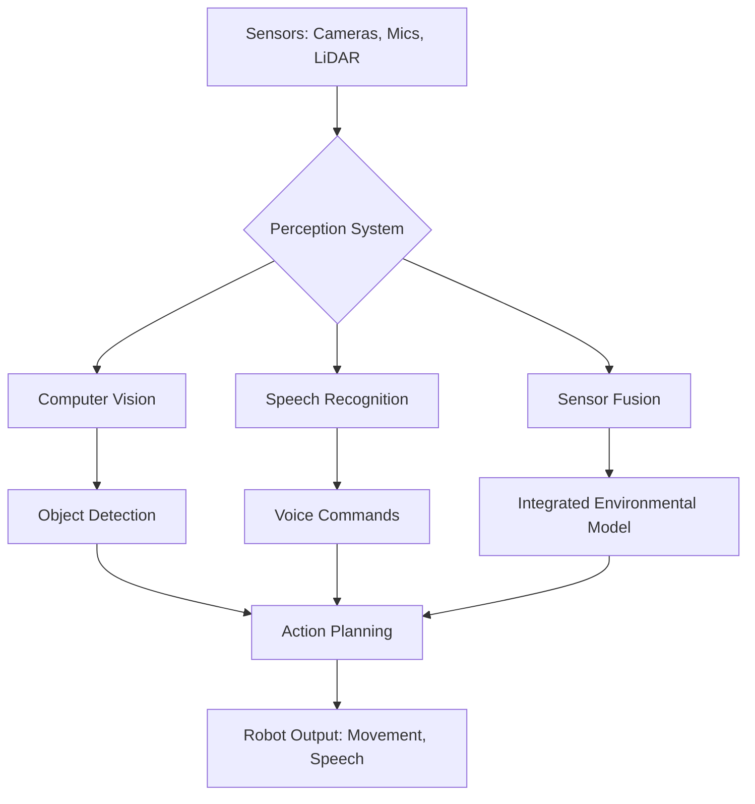

```mermaid
graph TD
    A[Sensors: Cameras, Mics, LiDAR] --> B{Perception System}
    B --> C[Computer Vision]
    B --> D[Speech Recognition]
    B --> E[Sensor Fusion]
    C --> F[Object Detection]
    D --> G[Voice Commands]
    E --> H[Integrated Environmental Model]
    F --> I[Action Planning]
    G --> I
    H --> I
    I --> J[Robot Output: Movement, Speech]
```
