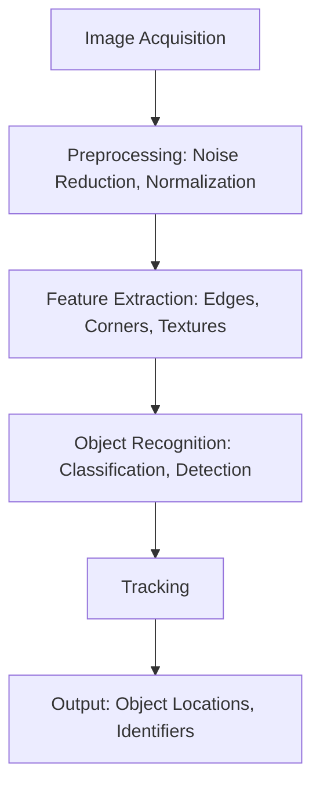

```mermaid
graph TD
    A[Image Acquisition] --> B[Preprocessing: Noise Reduction, Normalization]
    B --> C[Feature Extraction: Edges, Corners, Textures]
    C --> D[Object Recognition: Classification, Detection]
    D --> E[Tracking]
    E --> F[Output: Object Locations, Identifiers]
```
