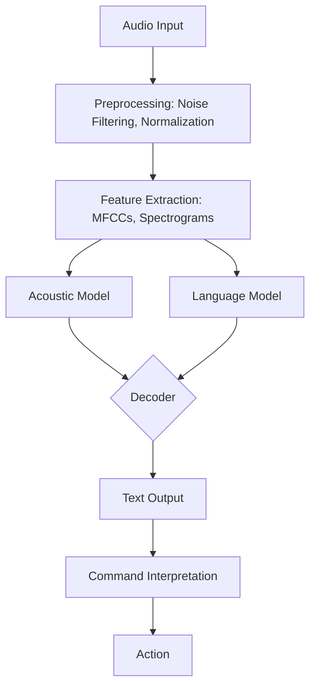

```mermaid
graph TD
    A[Audio Input] --> B[Preprocessing: Noise Filtering, Normalization]
    B --> C[Feature Extraction: MFCCs, Spectrograms]
    C --> D[Acoustic Model]
    C --> E[Language Model]
    D --> F{Decoder}
    E --> F
    F --> G[Text Output]
    G --> H[Command Interpretation]
    H --> I[Action]
```
