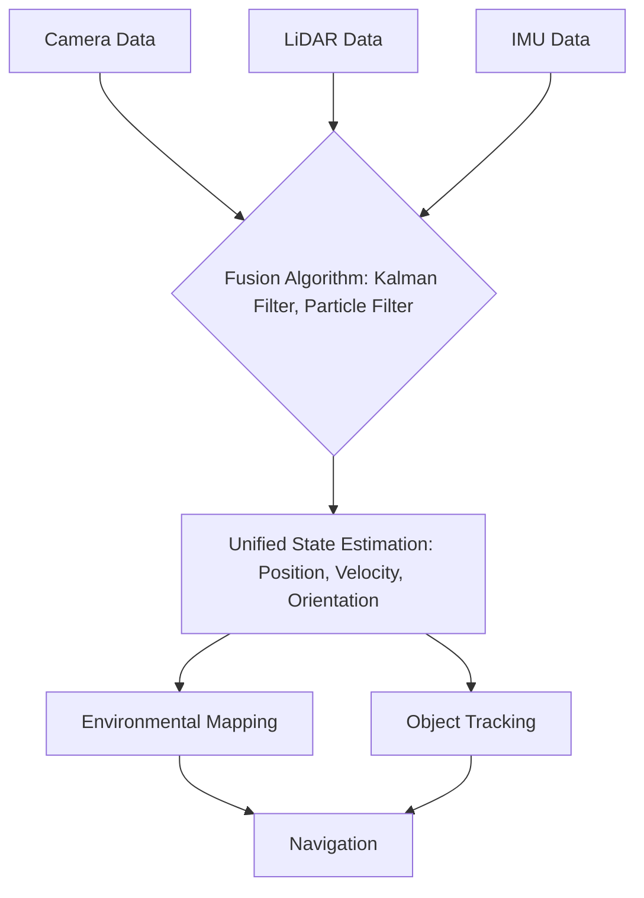

```mermaid
graph TD
    A[Camera Data] --> B{Fusion Algorithm: Kalman Filter, Particle Filter}
    C[LiDAR Data] --> B
    D[IMU Data] --> B
    B --> E[Unified State Estimation: Position, Velocity, Orientation]
    E --> F[Environmental Mapping]
    E --> G[Object Tracking]
    F --> H[Navigation]
    G --> H
```
