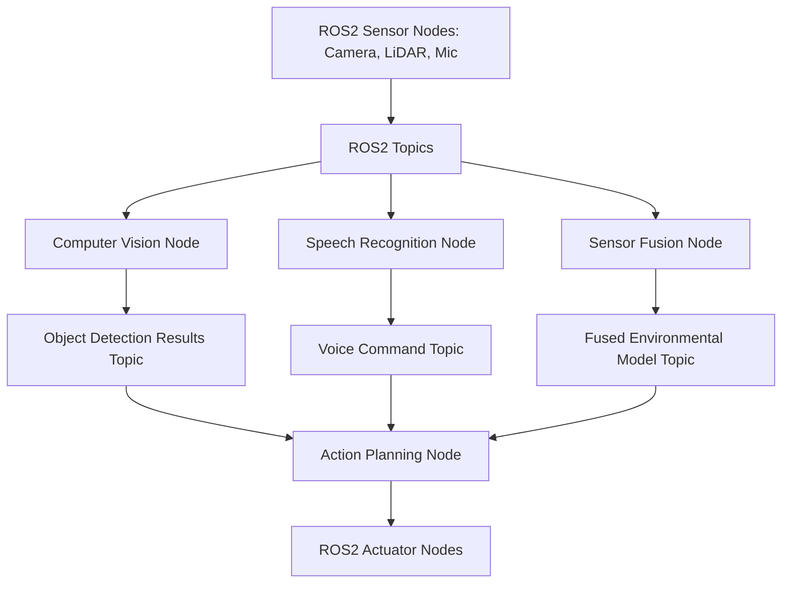

```mermaid
graph TD
    A[ROS2 Sensor Nodes: Camera, LiDAR, Mic] --> B[ROS2 Topics]
    B --> C[Computer Vision Node]
    B --> D[Speech Recognition Node]
    B --> E[Sensor Fusion Node]
    C --> F[Object Detection Results Topic]
    D --> G[Voice Command Topic]
    E --> H[Fused Environmental Model Topic]
    F --> I[Action Planning Node]
    G --> I
    H --> I
    I --> J[ROS2 Actuator Nodes]
```
