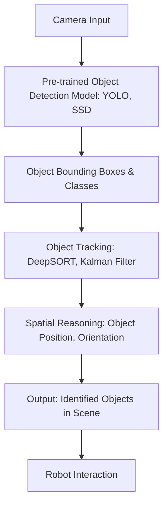

```mermaid
graph TD
    A[Camera Input] --> B[Pre-trained Object Detection Model: YOLO, SSD]
    B --> C[Object Bounding Boxes & Classes]
    C --> D[Object Tracking: DeepSORT, Kalman Filter]
    D --> E[Spatial Reasoning: Object Position, Orientation]
    E --> F[Output: Identified Objects in Scene]
    F --> G[Robot Interaction]
```
